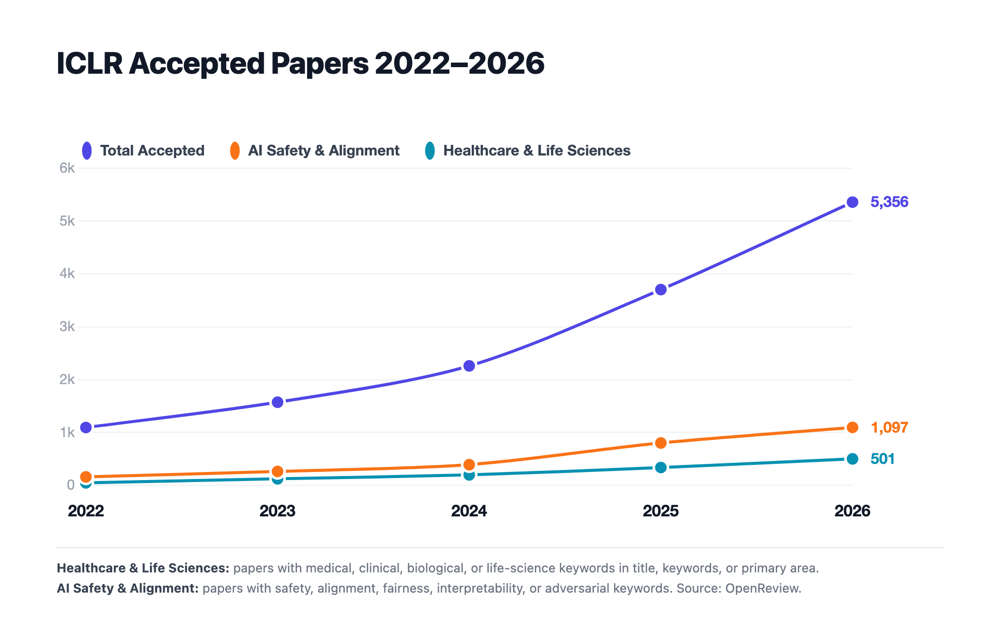
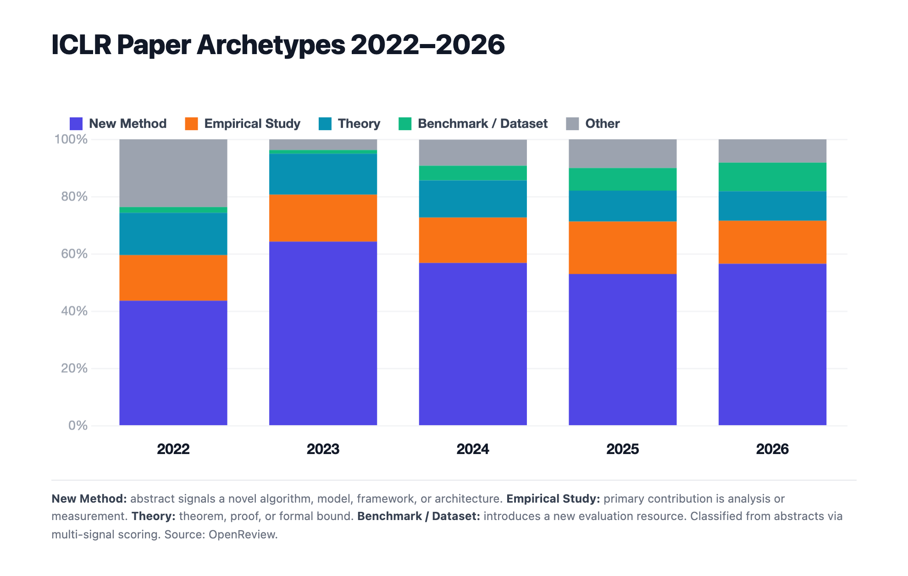
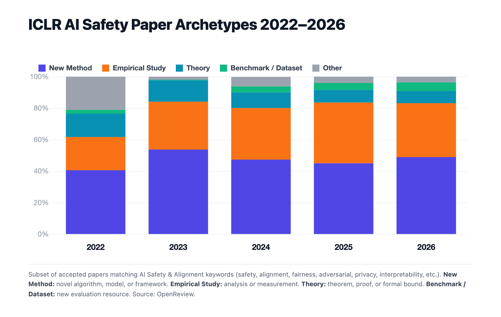
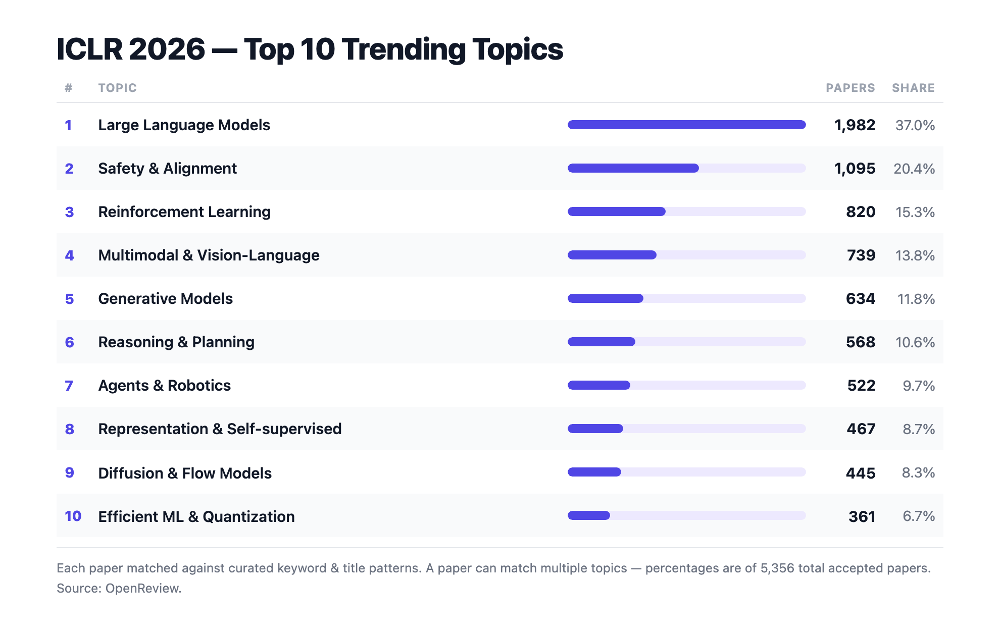
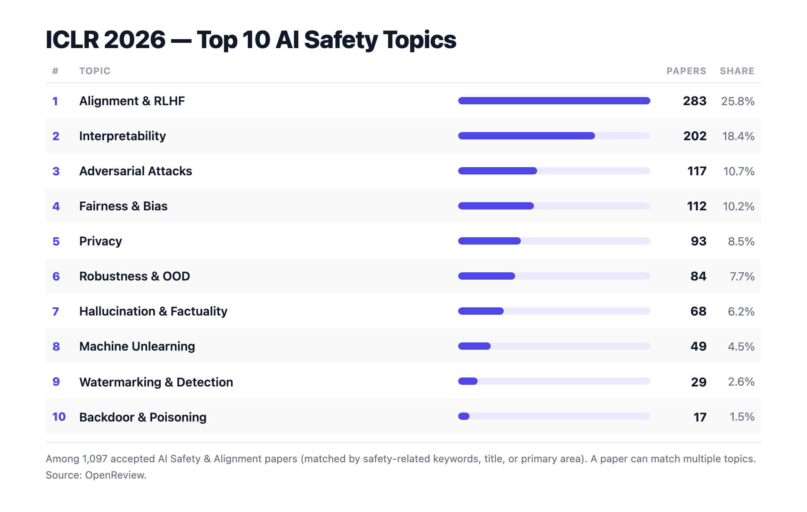
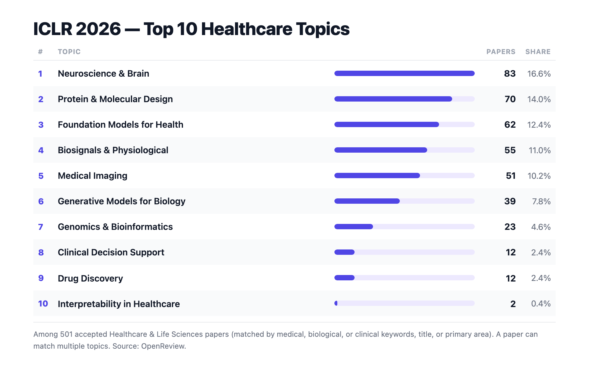

# Conference Stats

Data-driven visualizations of accepted paper trends at top ML conferences, starting with **ICLR 2026**.

All charts are generated from raw OpenReview metadata — no manual labeling, no external APIs at inference time. The pipeline fetches paper titles, abstracts, keywords, and primary areas, then classifies each paper with a rule-based multi-signal scorer to produce publication-ready PNG charts.

---

## ICLR 2026 — Charts

### Paper Growth (2022 – 2026)

Accepted submissions have grown ~3× over five years, from ~1,100 in 2022 to over 4,000 in 2026. AI Safety & Alignment papers have kept pace, now exceeding 1,000 accepted papers.



---

### Contribution Archetypes — All Papers

Each accepted paper is classified into one of five contribution types: **New Method**, **Empirical Study**, **Theory**, **Benchmark / Dataset**, or **Other**.



---

### Contribution Archetypes — AI Safety & Alignment Papers

Same classification, restricted to the AI safety subset.



---

### Trending Topics — All Papers

Topic counts for ICLR 2026. A paper can match multiple topics; the denominator is the total number of accepted papers.



---

### Trending Topics — AI Safety & Alignment Papers

Filtered to papers whose title, keywords, or primary area contain safety-related terms (adversarial, alignment, fairness, privacy, hallucination, etc.).



---

### Trending Topics — Healthcare & Life Sciences Papers

Filtered to papers whose title, keywords, or primary area contain healthcare-related terms (clinical, medical, biological, genomic, etc.).



---

## How It Works

### 1 — Data Collection (`fetch_iclr_openreview.py`)

Paper metadata is fetched from the [OpenReview API](https://openreview.net):
- **2022 – 2023**: OpenReview API v1
- **2024 – 2026**: OpenReview API v2

Each year's accepted papers are saved as an Excel file in `iclr_2026/data/`.

### 2 — Archetype Classification (`classify_archetypes.py`)

A multi-signal rule-based scorer assigns each paper a floating-point score across five archetypes. The classifier uses:

| Signal | How it works |
|---|---|
| **Strong regex hits** | Theorem/lemma/corollary for Theory; "we introduce … new benchmark" for Benchmark |
| **Verb–noun proximity** | "we propose" within 130 chars of a method noun, with no empirical noun intervening → New Method |
| **Primary area boost** | "datasets and benchmarks" primary area → hard-assign Benchmark |
| **Penalty terms** | Performance claims ("outperform", "state-of-the-art") penalize Empirical Study to avoid ablation papers being miscounted |

Results are written to `iclr_2026/data/archetypes_classified.json` and read by the plot script — no re-classification at plot time.

### 3 — Plot Generation (`generate_plot.py`)

Each chart is a standalone HTML page rendered to a 1980 × 1256 px PNG (2× device pixel ratio) via a headless Chromium browser (Playwright). Chart.js and chartjs-plugin-datalabels are vendored locally so the renderer works fully offline.

```
python iclr_2026/src/classify_archetypes.py          # pre-compute archetypes JSON
python iclr_2026/src/generate_plot.py <plot_name>    # render one chart
```

Available plot names:

| Name | Description |
|---|---|
| `number_of_papers` | Line chart — accepted papers per year |
| `contribution_archetypes` | Stacked bar — archetype breakdown, all papers |
| `contribution_archetypes_ai_safety` | Stacked bar — archetype breakdown, AI safety subset |
| `trending_topics` | Table — top topics, all ICLR 2026 papers |
| `trending_topics_ai_safety` | Table — top topics, AI safety papers |
| `trending_topics_healthcare` | Table — top topics, healthcare papers |

---

## Setup

```bash
pip install -r requirements.txt
playwright install chromium
```

**`requirements.txt`**
```
openreview-py>=2.2.0
pandas>=3.0.2
openpyxl>=3.1.5
playwright>=1.44.0
```

---

## Data Source

All paper metadata is sourced from [OpenReview.net](https://openreview.net) under its public API. No paper PDFs are downloaded or processed.
